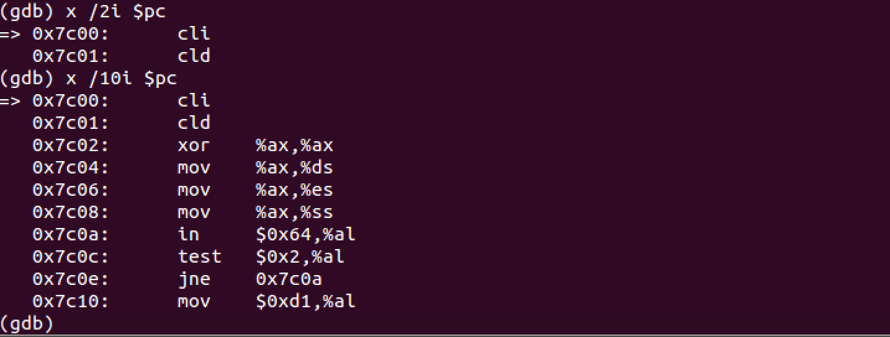
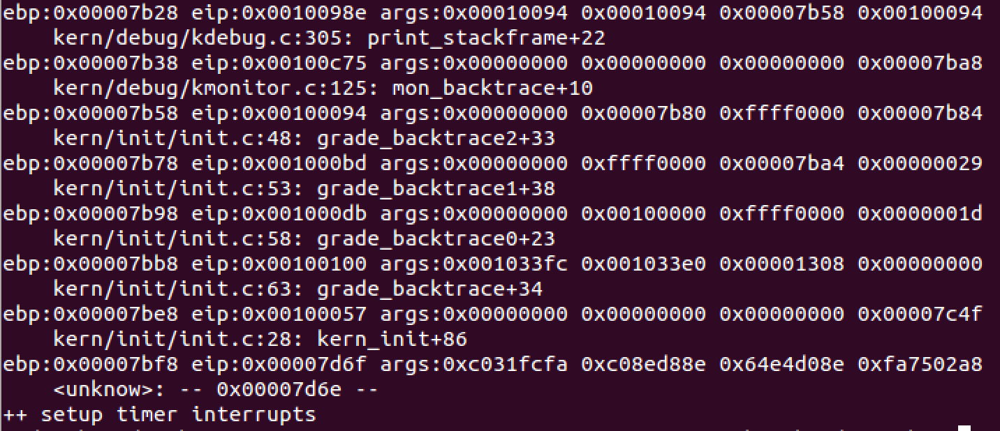
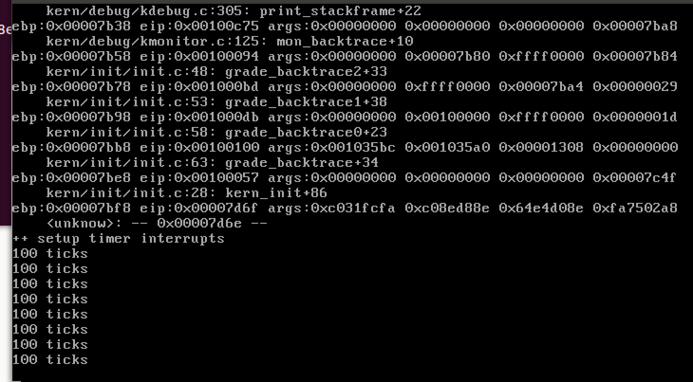

# Lab1实验报告
lab1-杨煜－2011010312.md
## 练习一
###1.1 操作系统镜像文件ucore.img是如何一步一步生成的？
(需要比较详细地解释Makefile中每一条相关命令和命令参数的含义，以及说明命令导致的结果)
bin/ucore.img
在Makefile文件中生成ucore.img的相关代码为

```
#create ucore.img
UCOREIMG	:= $(call totarget,ucore.img)
$(UCOREIMG): $(kernel) $(bootblock)
    $(V)dd if=/dev/zero of=$@ count=10000
    $(V)dd if=$(bootblock) of=$@ conv=notrunc
    $(V)dd if=$(kernel) of=$@ seek=1 conv=notrunc
$(call create_target,ucore.img)
```

很明显，生成ucore.img需要首先生成bootblock和kernel，其中，生成bootblock的相关代码为

```
$(bootblock): $(call toobj,$(bootfiles)) | $(call totarget,sign)
	@echo + ld $@
	$(V)$(LD) $(LDFLAGS) -N -e start -Ttext 0x7C00 $^ -o $(call toobj,bootblock)
	@$(OBJDUMP) -S $(call objfile,bootblock) > $(call asmfile,bootblock)
	@$(OBJCOPY) -S -O binary $(call objfile,bootblock) $(call outfile,bootblock)
	@$(call totarget,sign) $(call outfile,bootblock) $(bootblock)
```

生成kernel的相关代码为

```
# create kernel target
kernel = $(call totarget,kernel)

$(kernel): tools/kernel.ld

$(kernel): $(KOBJS)
	@echo + ld $@
	$(V)$(LD) $(LDFLAGS) -T tools/kernel.ld -o $@ $(KOBJS)
	@$(OBJDUMP) -S $@ > $(call asmfile,kernel)
	@$(OBJDUMP) -t $@ | $(SED) '1,/SYMBOL TABLE/d; s/ .* / /; /^$$/d' > $(call symfile,kernel)

$(call create_target,kernel)
```
		
在生成bootblock之前Makefile中有一段代码

```
bootfiles = $(call listf_cc,boot)
$(foreach f,$(bootfiles),$(call cc_compile,$(f),$(CC),$(CFLAGS) -Os -nostdinc))
```

这段代码用以从bootasm.S生成bootasm.o, 从命令行输出结果中找到这段由宏批量生成的代码为

```
i386-elf-gcc -Iboot/ -fno-builtin -Wall -ggdb -m32 -gstabs -nostdinc  -fno-stack-protector -Ilibs/ -Os -nostdinc -c boot/bootasm.S -o obj/boot/bootasm.o
cc boot/bootmain.c
```

其中的关键参数解释如下：

```
-ggdb 生成可供gdb使用的调试信息。因此之后可用qemu+gdb来调试bootloader和ucore。
-m32 生成32位环境的代码
-gstabs 生成stabs格式的调试信息。这样ucore的monitor可以显示出便于开发者阅读的函数调用栈信息
-nostdinc 不使用标准库
-fno-stack-protector 不生成用于检测缓冲区溢出的代码
-0s 为减小代码大小而进行优化。
```
	
下面这段代码从bootmain.c生成bootmain.o，参数与上述所描述的基本一致:

```
i386-elf-gcc -Iboot/ -fno-builtin -Wall -ggdb -m32 -gstabs -nostdinc  -fno-stack-protector -Ilibs/ -Os -nostdinc -c boot/bootmain.c -o obj/boot/bootmain.o
cc tools/sign.c
```

生成bin/sign工具的makefile代码为

```
# create 'sign' tools
$(call add_files_host,tools/sign.c,sign,sign)
$(call create_target_host,sign,sign)
```

实际由宏产生的编译命令为

```
gcc -Itools/ -g -Wall -O2 -c tools/sign.c -o obj/sign/tools/sign.o
gcc -g -Wall -O2 obj/sign/tools/sign.o -o bin/sign
```

###1.2 一个被系统认为是符合规范的硬盘主引导扇区的特征是什么？
查看sign.c源代码，可以看出一个磁盘主引导扇区有512字节。而且第510个字节时0x55，第511个字节时0xAA。

## 练习二
- 将lab1/tools/gdbinit内容修改为:

```
	set architecture i8086
	target remote :1234
```

- 在 lab1目录下，执行

```
	make debug
```

- 在看到gdb的调试界面(gdb)后，在gdb调试界面下执行如下命令

```
	info break
```

查看当前断点，显示只有在init()函数入口处有一个断点，继续输入

```
	b *0x7c00 ＃手动设置物理地址断点
	c #继续执行到该断点
```

- 在gdb界面下，可通过如下命令来看BIOS的代码

```
	x /2i $pc
	x /10i $pc #在0x7c00这个断点处显示10条$pc即将执行的结果
```

结果为：

与bootasm.S比较

结果基本一致。

在源码grade\_backtrace(void)函数处设置断点

```
	break grade_backtrace
	c ＃继续执行到该断点
	x /10i $pc 显示接下来的10条指令
```

结果为：


## 练习三
bootloader进入保护模式的过程, bootasm.S文件内容分析：

```
start:
.code16                        # Assemble for 16-bit mode
    cli                        # Disable interrupts
    cld                        # String operations increment
	 # Set up the important data segment registers (DS, ES, SS).
	 xorw %ax, %ax                    # Segment number zero
	 movw %ax, %ds                    # -> Data Segment
	 movw %ax, %es                    # -> Extra Segment
	 movw %ax, %ss                    # -> Stack Segment
```

以上这段代码执行初始环境清理并将DS，ES，SS各个段寄存器清零。

下面的代码初始化A20，通过对键盘控制器8042的操作：

```
	seta20.1:
	    inb $0x64, %al        #等待8042键盘控制器
	    testb $0x2, %al
	    jnz seta20.1
	
	    movb $0xd1, %al 
	    outb %al, $0x64       #向8042的P2端口写数据
	
	seta20.2:
	    inb $0x64, %al        #等待8042键盘控制器                     
	    testb $0x2, %al
	    jnz seta20.2
	
	    movb $0xdf, %al
	    outb %al, $0x60       #开启A20表
```

初始化GDT表：从引导区中直接载入

```
	lgdt gdtdesc
```

进入保护模式：通过将cr0寄存器PE位置1即可开启保护模式

```
	movl %cr0, %eax
	orl $CR0_PE_ON, %eax
	movl %eax, %cr0
```

长跳转更新CS基地址：

```
	ljmp $PROT_MODE_CSEG, $protcseg
```

在protcseg函数中完成：设置保护模式中的数据段寄存器，建立堆栈

```
	protcseg:
	    movw $PROT_MODE_DSEG, %ax
	    movw %ax, %ds                                  
	    movw %ax, %es                                   
	    movw %ax, %fs                                   
	    movw %ax, %gs                                   
	    movw %ax, %ss                                  
	# Stack Segment
	    movl $0x0, %ebp
	    movl $start, %esp
	    call bootmain   #最后进入boot主方法
```

## 练习四
###分析bootloader加载ELF格式的OS的过程
readsect从设备的第secno扇区读取数据到dst位置

```
	static void
	readsect(void *dst, uint32_t secno) {
	    waitdisk();
	    outb(0x1F2, 1);                // 设置读取扇区的数目为1
	    outb(0x1F3, secno & 0xFF);
	    outb(0x1F4, (secno >> 8) & 0xFF);
	    outb(0x1F5, (secno >> 16) & 0xFF);
	    outb(0x1F6, ((secno >> 24) & 0xF) | 0xE0);
	        // 上面四条指令联合制定了扇区号
	        // 在这4个字节线联合构成的32位参数中
	        //   29-31位强制设为1
	        //   28位(=0)表示访问"Disk 0"
	        //   0-27位是28位的偏移量
	    outb(0x1F7, 0x20);                // 0x20命令，读取扇区
	    waitdisk();
	    insl(0x1F0, dst, SECTSIZE / 4);   // 读取到dst位置
	}
```

readseg函数实现了对readsect的封装，它可以从设备读取任意长度的内容。

```
static void readseg(uintptr_t va, uint32_t count, uint32_t offset) {
    uintptr_t end_va = va + count;
    va -= offset % SECTSIZE;
    uint32_t secno = (offset / SECTSIZE) + 1; 
    // 加1因为0扇区被引导占用
    // ELF文件从1扇区开始
    for (; va < end_va; va += SECTSIZE, secno ++) {
        readsect((void *)va, secno);
    }
}
```

在bootmain函数中（即bootloader的入口处）

```
void bootmain(void) {
    // 首先读取ELF的头部
    readseg((uintptr_t)ELFHDR, SECTSIZE * 8, 0);
    // 通过储存在头部的幻数判断是否是合法的ELF文件
    if (ELFHDR->e_magic != ELF_MAGIC) {
        goto bad;
    }
    struct proghdr *ph, *eph;
    // ELF头部有描述ELF文件应加载到内存什么位置的描述表，
    // 先将描述表的头地址存在ph
    ph = (struct proghdr *)((uintptr_t)ELFHDR + ELFHDR->e_phoff);
    eph = ph + ELFHDR->e_phnum;
    // 按照描述表将ELF文件中数据载入内存
    for (; ph < eph; ph ++) {
        readseg(ph->p_va & 0xFFFFFF, ph->p_memsz, ph->p_offset);
    }
    // 根据ELF头部储存的入口信息，找到内核的入口,该函数不再返回
    ((void (*)(void))(ELFHDR->e_entry & 0xFFFFFF))();
bad:
    outw(0x8A00, 0x8A00);
    outw(0x8A00, 0x8E00);
    while (1);
    }
```

## 练习五
修改kedebug.c代码中的print\_stackframe函数，再运行make qemu输出如下结果：



其中最后一行

```
	ebp:0x00007bf8 eip:0x00007d6f args:0xc031fcfa 0xc08ed88e 0x64e4d08e 0xfa7502a8
```

输出过程是按照从堆栈顶到堆栈底部的顺序输出的，因此最后一行表示堆栈底部，对应的是第一个使用堆栈的函数，即bootmain.c中的bootmain。bootloader设置的堆栈从`0x7c00`开始，使用"call bootmain"转入bootmain函数。call指令压栈，所以bootmain中ebp为`0x7bf8`。
## 练习六
###完善中断初始化和处理 
1. **中断描述符表（也可简称为保护模式下的中断向量表）中一个表项占多少字节？其中哪几位代表中断处理代码的入口？**

    中断向量表一个表项占用8字节，其中2-3字节是段选择子，0-1字节和6-7字节拼成位移offset，两者联合便是中断处理程序的入口地址。
    
2. **完善kern/trap/trap.c中对中断向量表进行初始化的函数idt_init。在idt_init函数中，依次对所有中断入口进行初始化。使用mmu.h中的SETGATE宏，填充idt数组内容。**

    查看mmu.h中对SETGATE宏的定义为

```
	#define SETGATE(gate, istrap, sel, off, dpl){        \
	    (gate).gd_off_15_0 = (uint32_t)(off) & 0xffff;  \
	    (gate).gd_ss = (sel);                           \
	    (gate).gd_args = 0;                             \
	    (gate).gd_rsv1 = 0;                             \
	    (gate).gd_type = (istrap) ? STS_TG32 : STS_IG32;\
	    (gate).gd_s = 0;                                \
	    (gate).gd_dpl = (dpl);                          \
	    (gate).gd_p = 1;                                \
	    (gate).gd_off_31_16 = (uint32_t)(off) >> 16;    \
	}
```

3. **完善trap.c中的中断处理函数trap，在对时钟中断进行处理的部分填写trap函数中处理时钟中断的部分，使操作系统每遇到100次时钟中断后，调用print\_ticks子程序，向屏幕上打印一行文字”100 ticks”。**

最终输出结果为：
